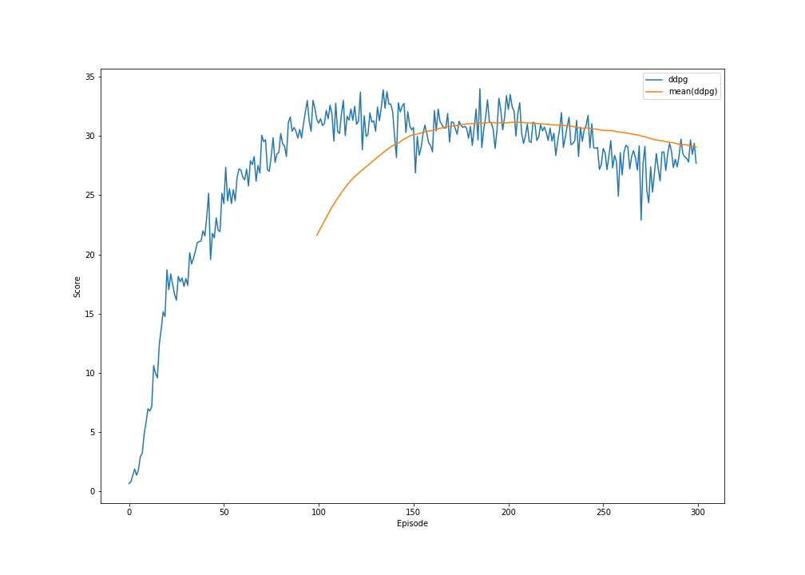

# Report
by Luca Schweri, 2022

The results shown are achieved using the environment with 20 agents.

## Learning Algorithms

### PPO with Gaussian Network

#### Architecture

The following list describes the layers of the network:
1) Linear(33 -> 128) -> ReLU
2) Linear(128 -> 32) -> ReLU
3) Linear(32 -> 1) -> tanh

The network returns the mean of a normal distribution and the variance is continuously decreasing by 0.995 per episode from 1.0.
The implementation of the architecture can be found in [gaussian_network.py](networks/gaussian_network.py).

#### Hyperparameters

- Number of Episodes for Training: 300
- Learning Rate: 0.0001
- Discount Factor: 0.99
- Clip Epsilon used for clipping probability ratio in surrogate loss function: 0.1
- Number of updates per episode: 20

It uses Proximal Policy Optimization (PPO) [Schulman et al.](https://arxiv.org/abs/1707.06347)

The configurations for this approach can be found in [config.json](data/gaussian_ppo/config.json) with the name "ppo".

#### Results

The plots and saved network parameters can be found in [dqn](data/gaussian_ppo).

### A2C with Gaussian network

#### Architecture

**Actor Network**:

The following list describes the layers of the network:
1) Linear(33 -> 128) -> ReLU
2) Linear(128 -> 32) -> ReLU
3) Linear(32 -> 1) -> tanh

The network returns the mean of a normal distribution and the variance is continuously decreasing by 0.995 per episode from 1.0.
The implementation of the architecture can be found in [gaussian_network.py](networks/gaussian_network.py).

**Critic Network**:

1) Linear(33 -> 128) -> ReLU
2) Linear(128 -> 32) -> ReLU
3) Linear(32 -> 1)

The implementation of the architecture can be found in [dq_network.py](networks/dq_network.py).

#### Hyperparameters

- Number of Episodes for Training: 300
- Actor Learning Rate: 0.0001
- Critic Learning Rate: 0.0005
- Experience replay buffer size: 100000
- Batch size: 128
- Learning every ? steps: 8
- Learning repetitions: 1
- Discount Factor: 0.99
- Clip Epsilon used for clipping probability ratio in surrogate loss function: 0.1
- Exponential Moving Average Factor for Target Network Updates: 0.001
- N-step bootstrapping parameter: 5

It uses Advantage Actor Critic (A2C) [Mnih et al.](https://arxiv.org/abs/1602.01783) with a Proximal Policy Optimization (PPO) [Schulman et al.](https://arxiv.org/abs/1707.06347) actor and a DQN critic which uses double Q-learning and a experience replay buffer. The double Q-learning method was introduced by [van Hasselt et al.](https://arxiv.org/pdf/1509.06461).

The configurations for this approach can be found in [config.json](data/gaussian_a2c/config.json) with the name "a2c".

#### Results

The plots and saved network parameters can be found in [gaussian_ppo](data/gaussian_a2c).

### DDPG

#### Architecture

**Actor Network**:

The following list describes the layers of the network:
1) Linear(33 -> 128) -> ReLU
2) Linear(128 -> 32) -> ReLU
3) Linear(32 -> 1)

The network output is then clipped to a value between [-1; 1] to fit the action space.
The implementation of the architecture can be found in [ddpg_actor_network.py](networks/ddpg_actor_network.py).

**Critic Network**:

1) Linear(37 -> 128) -> ReLU
2) Linear(128 -> 32) -> ReLU
3) Linear(32 -> 1)

The implementation of the architecture can be found in [ddpg_critic_network.py](networks/dq_network.py).

#### Hyperparameters

- Number of Episodes for Training: 300
- Actor Learning Rate: 0.0001
- Critic Learning Rate: 0.0005
- Experience replay buffer size: 100000
- Batch size: 128
- Learning every ? steps: 1
- Learning repetitions: 1
- Discount Factor: 0.99
- Exponential Moving Average Factor for Target Network Updates: 0.001
- N-step bootstrapping parameter: 5

It uses Deep Deterministic Policy Gradients (DDPG) [Lillicrap et al.](https://arxiv.org/abs/1509.02971)

The configurations for this approach can be found in [config.json](data/ddpg/config.json) with the name "ddpg".

#### Results

The plots and saved network parameters can be found in [dqn_prioritized](data/ddpg).

## Comparison

On the following image you can compare the four approaches over 300 episodes. The plot shows the 100 episodes moving average:
- **gaussian_ppo**: PPO with Gaussian network
- **gaussian_a2c**: A2C with Gaussian network
- **ddpg**: DDPG

## Ideas

The following is list of possible further improvements of the agent:
- **Avoid Large Decrease in Score**: If after an update the agent performs much worse than before reset the parameters to the old value before the update. One example is the large drop at the end of training the A2C network. Other methods might be used but one need to further investigate why the sudden drop in score happens.
- **Averaging N-Step Bootstrapping**: Average the value given by different N-step bootstrapping parameters.
- **Learn also the Variance of Normal Distribution**: The Gaussian network learns only the mean and the variance is decreased with every episode. One can also simultaneously learn the variance, but I think a more complicated network and some regularization would be needed.
- **Tanh instead of Clipping**: Instead of clipping the action output to [-1,1] one could use the tanh activation function.
- **Random State Perturbations**: For the models using experience replay buffer the state could be perturbed by a little to gain robustness.
- **Adversarial Training**: A better way to gain robustness would be to use adversarial training.
- **State Normalization**: If we would have some more information about the state, one could normalize the state before using it as input for the network. This might help.
- **Next State Prediction**: Additional to the action values the network should predict the next state of each action. This might help in finding better network parameters because the next state is correlated with the action values.
- **Different Network**: I have used very easy networks. Many more network architectures can be tested.
- **Further Hyperparameter Tuning**: I did some hyperparameter tuning but there is still some room for improvements.